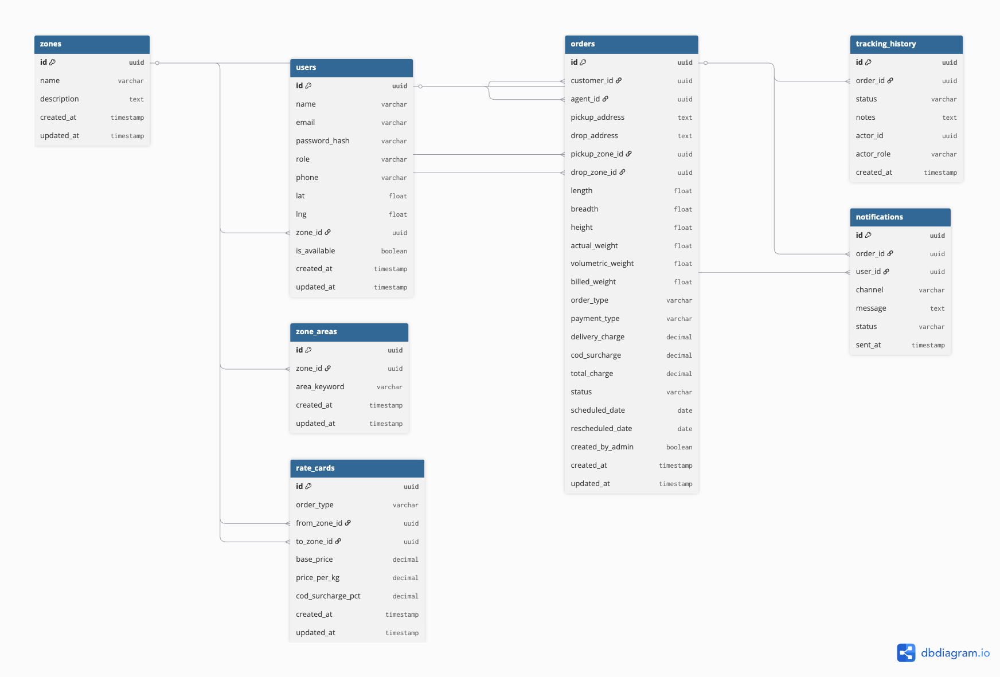
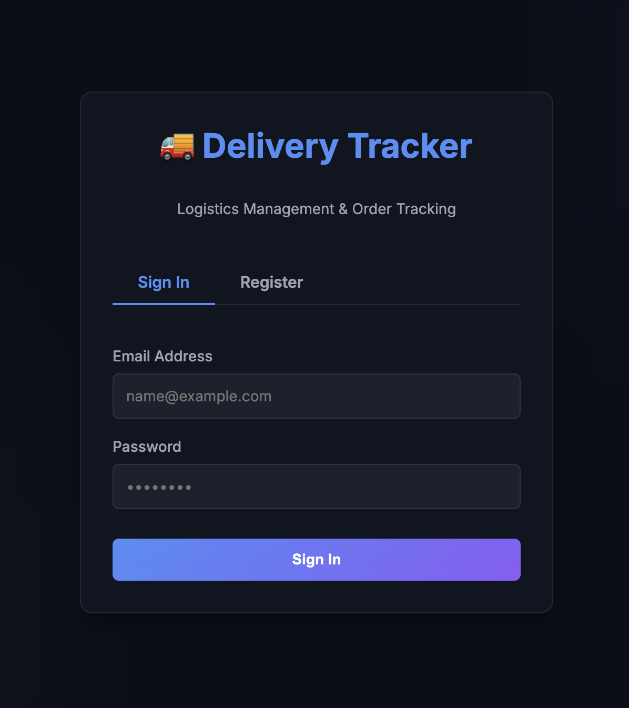
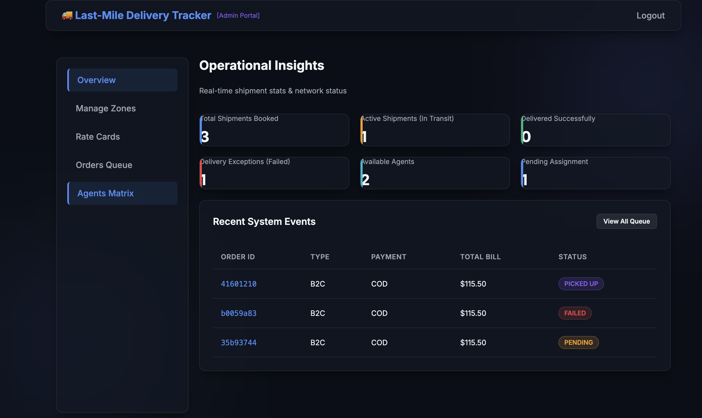
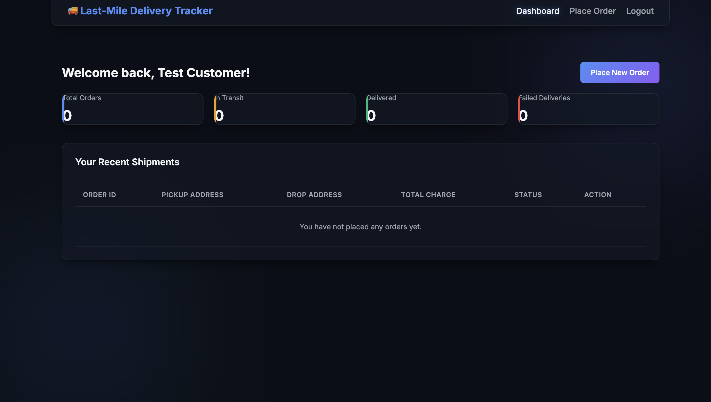
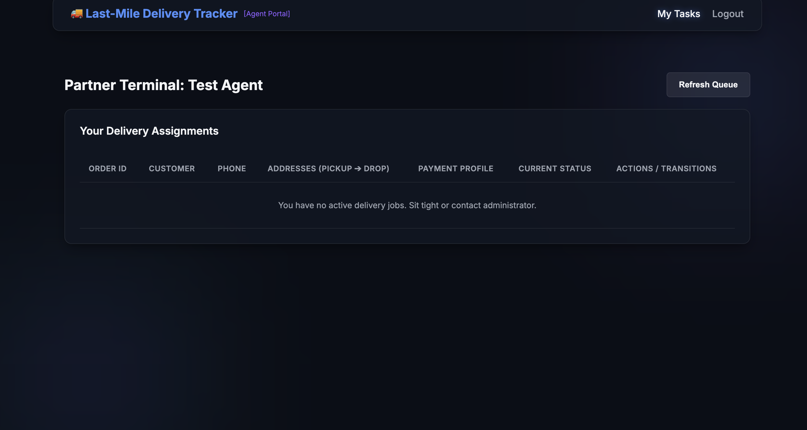
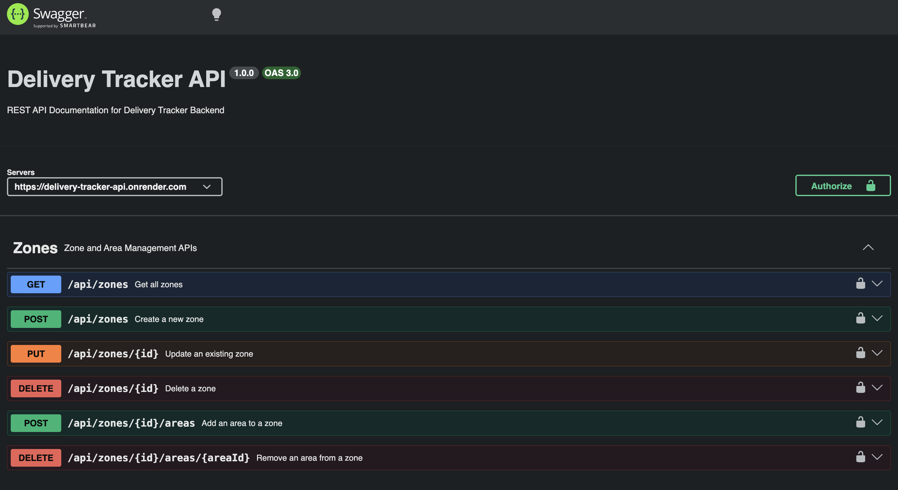

<div align="center">

# 🚚 Delivery Tracker System

### Intelligent Last-Mile Logistics Management Platform

*A full-stack logistics platform for managing last-mile deliveries with dynamic pricing, automatic agent assignment, delivery tracking, notifications, and role-based access control.*

<br>


</div>

---

## 🌐 Live Demo

| Service | URL |
|---------|-----|
| 🚀 Frontend | https://delivery-tracker-blond-tau.vercel.app |
| ⚙️ Backend API | https://delivery-tracker-api.onrender.com |
| 📖 Swagger Docs | https://delivery-tracker-api.onrender.com/api-docs |

---
# 📖 Overview

The **Delivery Tracker System** is a full-stack logistics platform designed to simplify and automate **last-mile delivery operations**.

The platform enables customers to calculate shipping charges, create delivery orders, track shipments in real time, and receive delivery notifications, while administrators manage pricing, delivery zones, and agent assignments.

Unlike a basic CRUD application, this project implements several real-world backend engineering concepts, including:

- Dynamic pricing based on delivery zones
- Volumetric weight calculation
- Automatic nearest-agent assignment
- Immutable delivery tracking history
- Role-Based Access Control (RBAC)
- Email notification pipeline
- Configurable rate cards
- Swagger API documentation

The system follows a **modular service-oriented architecture**, where business logic is organized into independent services responsible for pricing, zone detection, assignment, tracking, and notifications.

---

## 📌 Project Status

✅ Production Ready

✔ Fully Deployed

✔ REST API

✔ JWT Authentication

✔ PostgreSQL

✔ Swagger Documentation

✔ Responsive Frontend

---

# 🎯 Project Objectives

The project was built to simulate a production-style logistics backend capable of handling the complete lifecycle of a delivery order.

The primary objectives are:

- Automate delivery charge calculation
- Reduce manual delivery agent assignment
- Maintain complete delivery history
- Provide configurable business rules
- Ensure secure role-based access
- Deliver a scalable backend architecture

---

# ✨ Key Features

## 🔐 Authentication & Authorization

- JWT Authentication
- Secure password hashing using bcrypt
- Role-Based Access Control (RBAC)
- Protected REST APIs
- User profile endpoint

Supported Roles:

- 👨‍💼 Admin
- 👤 Customer
- 🚚 Delivery Agent

---

## 📦 Order Management

- Delivery charge estimation
- Order creation
- Order retrieval
- Order tracking
- Order lifecycle management
- Failed delivery rescheduling
- Customer order history

---

## 📍 Zone Management

- Create delivery zones
- Update delivery zones
- Delete delivery zones
- Configure multiple area keywords
- Automatic pickup zone detection
- Automatic drop zone detection

---

## 💰 Dynamic Pricing Engine

The pricing engine calculates delivery charges dynamically using:

- Pickup Zone
- Drop Zone
- Order Type (B2B/B2C)
- Actual Weight
- Volumetric Weight
- COD Charges

Pricing rules are completely database-driven.

---

## 🚚 Intelligent Agent Assignment

Two assignment strategies are supported:

### Manual Assignment

Administrators can manually assign any available delivery agent.

### Automatic Assignment

The platform automatically:

- finds available agents
- prioritizes agents from the pickup zone
- calculates geographic distance using the Haversine Formula
- assigns the nearest available agent

---

## 📈 Delivery Tracking

Every delivery status transition is permanently stored.

Supported statuses include:

- Pending
- Assigned
- Picked Up
- In Transit
- Out for Delivery
- Delivered
- Failed

Unlike traditional systems, previous tracking records are never overwritten.

---

## 📬 Notification System

The platform automatically sends notifications whenever the delivery status changes.

Supported channels:

- Email (Nodemailer)
- SMS (Twilio – Optional)

Every notification attempt is logged in the database for auditing purposes.

---

## 📖 API Documentation

The backend includes interactive API documentation powered by Swagger.

Features include:

- JWT Authorization
- Request examples
- Response examples
- Interactive endpoint testing

---

# 📊 Project Statistics

| Metric | Value |
|---------|------:|
| REST APIs | 25+ |
| Database Tables | 7 |
| User Roles | 3 |
| Core Services | 4 |
| Notification Channels | 2 |
| Authentication Method | JWT |
| Database | PostgreSQL |
| API Documentation | Swagger |

---

# 🛠 Technology Stack

| Category | Technology |
|-----------|------------|
| Frontend | HTML5, CSS3, JavaScript |
| Backend | Node.js, Express.js |
| Database | PostgreSQL |
| ORM | Sequelize |
| Authentication | JWT, bcrypt |
| API Documentation | Swagger (OpenAPI) |
| Email | Nodemailer |
| SMS | Twilio *(Optional)* |
| Version Control | Git & GitHub |

---

# 🏗 System Architecture

```
                       +-------------------------+
                       |     Frontend (UI)       |
                       | HTML • CSS • JavaScript |
                       +------------+------------+
                                    |
                             REST API Requests
                                    |
                                    ▼
                       +-------------------------+
                       |   Express.js Backend    |
                       +------------+------------+
                                    |
       +------------+---------------+---------------+------------+
       |            |               |               |            |
       ▼            ▼               ▼               ▼            ▼
 Rate Engine   Zone Detector   Assignment     Tracking    Notification
                                Service        Service       Service
       \            |               |               |            /
        \-----------+---------------+---------------+-----------/
                                    |
                                    ▼
                       +-------------------------+
                       |     PostgreSQL DB       |
                       +-------------------------+
                                    |
                                    ▼
                      Nodemailer (Email) • Twilio (SMS)
```

---

# 📂 Repository Structure

```text
delivery-tracker/
│
├── backend/
│   ├── src/
│   │   ├── config/
│   │   ├── controllers/
│   │   ├── middlewares/
│   │   ├── models/
│   │   ├── routes/
│   │   ├── services/
│   │   ├── docs/
│   │   ├── app.js
│   │   └── server.js
│   │
│   ├── package.json
│   └── .env.example
│
├── frontend/
│   ├── admin/
│   ├── customer/
│   ├── agent/
│   ├── css/
│   ├── js/
│   └── index.html
│
├── docs/
│   └── images/
│       ├── er-diagram.png
│       ├── swagger.png
│       ├── login.png
│       ├── admin-dashboard.png
│       ├── customer-dashboard.png
│       └── agent-dashboard.png
│
├── README.md
└── SYSTEM_DESIGN.md
```

---

# 📑 Table of Contents

- Overview
- Project Objectives
- Features
- Technology Stack
- Architecture
- Installation Guide
- Environment Variables
- Running the Project
- API Documentation
- Authentication
- API Reference
- Database Design
- Project Workflow
- Screenshots
- Testing
- Deployment
- Future Enhancements
- Contributing
- License
- Author

---

# ⚙️ Getting Started

This section explains how to set up and run the project locally.

## Prerequisites

Before running the application, ensure the following software is installed:

| Software | Version |
|----------|---------|
| Node.js | v18 or later |
| npm | Latest |
| PostgreSQL | v14 or later |
| Git | Latest |

Verify your installation:

```bash
node -v
npm -v
psql --version
git --version
```

---

# 📥 Installation

## 1. Clone the Repository

```bash
git clone <repository-url>
cd delivery-tracker
```

> Replace `<repository-url>` with your GitHub repository URL after publishing the project.

---

## 2. Install Backend Dependencies

```bash
cd backend
npm install
```

---

## 3. Configure Environment Variables

Create a `.env` file inside the `backend` directory.

```bash
cp .env.example .env
```

Then update the values according to your local setup.

---

## 4. Configure PostgreSQL

Create a PostgreSQL database.

```sql
CREATE DATABASE delivery_tracker;
```

Update your `.env` file with the correct database credentials.

---

## 5. Start the Backend

```bash
npm run dev
```

Expected output:

```text
Database connection has been established successfully.
Database models synchronized.
Server is running on http://localhost:5001
```

---

## 6. Launch the Frontend

Open:

```
frontend/index.html
```

or serve it locally:

```bash
npx serve frontend
```

---

# 🔑 Environment Variables

Create a `.env` file inside the `backend` folder.

Example configuration:

```env
# Server
PORT=5001

# PostgreSQL
DB_HOST=localhost
DB_PORT=5432
DB_NAME=delivery_tracker
DB_USER=postgres
DB_PASSWORD=your_password

# JWT
JWT_SECRET=your_super_secret_key

# SMTP
SMTP_HOST=smtp.gmail.com
SMTP_PORT=587
SMTP_USER=your_email@gmail.com
SMTP_PASS=your_16_character_app_password
SMTP_FROM=Delivery Tracker <your_email@gmail.com>

# Twilio (Optional)
TWILIO_ACCOUNT_SID=
TWILIO_AUTH_TOKEN=
TWILIO_PHONE_NUMBER=

# Frontend
FRONTEND_URL=http://localhost:3000
```

> **Security Note:** Never commit your `.env` file to version control. Use `.env.example` for sharing configuration templates.

---

# ▶️ Running the Project

### Start the Backend

```bash
cd backend
npm run dev
```

The API will be available at:

```
http://localhost:5001
```

---

### Open the Frontend

If using static files:

```
frontend/index.html
```

Or serve the frontend:

```bash
npx serve frontend
```

---

# 📖 API Documentation

Interactive API documentation is available through **Swagger UI**.

After starting the backend, visit:

```
http://localhost:5001/api-docs
```

Swagger provides:

- Interactive API explorer
- JWT authentication support
- Request & response examples
- Endpoint descriptions
- Live API testing

---

# 🔐 Authentication

The platform uses **JWT (JSON Web Tokens)** for secure authentication.

## Login

```
POST /api/auth/login
```

Example Response:

```json
{
  "token": "<jwt-token>",
  "user": {
    "id": "xxxxxxxx",
    "name": "Rahul Sharma",
    "role": "customer"
  }
}
```

Use the returned token in subsequent requests:

```
Authorization: Bearer <jwt-token>
```

---

# 👥 User Roles

The application supports three user roles.

## 👨‍💼 Administrator

Responsible for:

- Managing Zones
- Managing Zone Areas
- Managing Rate Cards
- Viewing all Orders
- Manual Agent Assignment
- Automatic Agent Assignment
- Updating Agent Availability
- Overriding Order Status

---

## 👤 Customer

Responsible for:

- Registration & Login
- Delivery Charge Calculation
- Creating Orders
- Tracking Deliveries
- Rescheduling Failed Deliveries

---

## 🚚 Delivery Agent

Responsible for:

- Viewing Assigned Orders
- Updating Delivery Status
- Completing Deliveries
- Reporting Failed Deliveries

---

# 📚 API Reference

## Authentication

| Method | Endpoint | Description |
|---------|----------|-------------|
| POST | `/api/auth/register` | Register a new user |
| POST | `/api/auth/login` | Login user |
| GET | `/api/auth/me` | Get authenticated user |

---

## Zone Management

| Method | Endpoint | Description |
|---------|----------|-------------|
| GET | `/api/zones` | List all zones |
| POST | `/api/zones` | Create zone |
| PUT | `/api/zones/{id}` | Update zone |
| DELETE | `/api/zones/{id}` | Delete zone |
| POST | `/api/zones/{id}/areas` | Add zone area |
| DELETE | `/api/zones/{id}/areas/{areaId}` | Remove zone area |

---

## Rate Card Management

| Method | Endpoint | Description |
|---------|----------|-------------|
| GET | `/api/rate-cards` | List rate cards |
| POST | `/api/rate-cards` | Create rate card |
| PUT | `/api/rate-cards/{id}` | Update rate card |
| DELETE | `/api/rate-cards/{id}` | Delete rate card |

---

## Order Management

| Method | Endpoint | Description |
|---------|----------|-------------|
| POST | `/api/orders/calculate-charge` | Calculate delivery charges |
| GET | `/api/orders` | List orders |
| POST | `/api/orders` | Create order |
| GET | `/api/orders/{id}` | Get order details |
| GET | `/api/orders/{id}/tracking` | Get tracking history |
| PUT | `/api/orders/{id}/assign` | Manual agent assignment |
| POST | `/api/orders/{id}/auto-assign` | Automatic agent assignment |
| POST | `/api/orders/{id}/status` | Update delivery status |
| POST | `/api/orders/{id}/reschedule` | Reschedule failed delivery |

---

## Agent Management

| Method | Endpoint | Description |
|---------|----------|-------------|
| GET | `/api/agents` | List delivery agents |
| PUT | `/api/agents/{id}/availability` | Update agent availability |

---

# 📌 API Testing

The backend APIs have been thoroughly tested using **Postman**.

The Postman collection covers:

- User Authentication
- Zone Management
- Rate Card Management
- Delivery Charge Calculation
- Order Creation
- Order Assignment
- Delivery Tracking
- Failed Delivery Flow
- Notifications
- Agent Availability

Swagger UI and Postman together provide comprehensive API validation and testing support.

---

# 🗄️ Database Design

The Delivery Tracker System uses **PostgreSQL** as its relational database. The schema is designed to support configurable pricing, role-based user management, delivery tracking, and notification logging while maintaining data integrity through foreign key relationships.

## Core Entities

| Entity | Purpose |
|---------|---------|
| **Users** | Stores administrators, customers, and delivery agents |
| **Orders** | Stores delivery requests and their lifecycle |
| **Zones** | Represents delivery regions |
| **Zone Areas** | Maps address keywords to zones |
| **Rate Cards** | Configurable pricing between zones |
| **Tracking History** | Immutable order status timeline |
| **Notifications** | Email and SMS delivery logs |

---

# 📊 Entity Relationship Diagram (ER Diagram)

The database schema is illustrated below.

<p align="center">
  
</p>

The schema demonstrates:

- Role-based user management
- Dynamic pricing using configurable rate cards
- Immutable tracking history
- Notification logging
- Zone-based delivery management

---

# 🔄 Order Lifecycle

Every order follows a predefined lifecycle from creation to successful delivery.

```text
Pending
    │
    ▼
Assigned
    │
    ▼
Picked Up
    │
    ▼
In Transit
    │
    ▼
Out for Delivery
    │
    ├────────────► Delivered
    │
    ▼
Failed
    │
    ▼
Customer Reschedules
    │
    ▼
Pending
```

Unlike traditional systems, **no previous status is overwritten**.

Each transition creates a new record in the **Tracking History** table, ensuring complete auditability.

---

# ⚙️ End-to-End Business Workflow

The following diagram illustrates the complete flow of an order through the system.

```text
Customer
    │
    ▼
Calculate Delivery Charges
    │
    ▼
Zone Detection
    │
    ▼
Dynamic Pricing Engine
    │
    ▼
Create Order
    │
    ▼
Auto / Manual Agent Assignment
    │
    ▼
Agent Updates Delivery Status
    │
    ▼
Tracking History Updated
    │
    ▼
Notification Service
    │
    ▼
Customer Receives Email / SMS
    │
    ▼
Order Delivered
```

---

# 💰 Dynamic Pricing Engine

The platform calculates delivery charges dynamically instead of relying on hardcoded values.

The pricing engine considers:

- Pickup Zone
- Drop Zone
- Order Type (B2B / B2C)
- Actual Weight
- Volumetric Weight
- COD Surcharge

Processing flow:

```text
Pickup Address
      │
      ▼
Pickup Zone
      │
      ▼
Drop Address
      │
      ▼
Drop Zone
      │
      ▼
Calculate Volumetric Weight
      │
      ▼
Calculate Billed Weight
      │
      ▼
Lookup Rate Card
      │
      ▼
Calculate Delivery Charge
      │
      ▼
Apply COD Surcharge (if applicable)
      │
      ▼
Final Charge
```

All pricing rules are stored in the **Rate Cards** table, allowing administrators to modify pricing without changing application code.

---

# 📍 Zone Detection

Delivery zones are identified using configurable **area keywords**.

Example:

```text
North Zone
├── Connaught Place
├── Civil Lines
├── Karol Bagh
├── 110001
```

If a delivery address contains one of these keywords, the corresponding zone is assigned automatically.

### Example

```
Connaught Place, Delhi
```

↓

```
North Zone
```

This keyword-based approach removes the dependency on third-party geocoding services while remaining fully configurable by administrators.

---

# 🚚 Intelligent Agent Assignment

The system supports both **manual** and **automatic** agent assignment.

## Manual Assignment

Administrators can assign any available delivery agent.

---

## Automatic Assignment

The assignment algorithm performs the following steps:

1. Retrieve all available agents.
2. Prioritize agents within the pickup zone.
3. Calculate the distance using the **Haversine Formula**.
4. Select the nearest available agent.
5. Assign the order.
6. Mark the agent as unavailable.

This minimizes travel distance while preventing double assignment.

---

# 📈 Tracking History

Instead of modifying a single status field, every status transition generates a new tracking record.

Example:

| Status | Updated By | Description |
|---------|------------|-------------|
| Pending | Customer | Order created |
| Assigned | Admin | Agent assigned |
| Picked Up | Agent | Package collected |
| In Transit | Agent | Package in transit |
| Delivered | Agent | Order delivered |

This creates a permanent audit trail for every delivery.

---

# 📬 Notification Pipeline

Every successful status update triggers the Notification Service.

```text
Status Updated
      │
      ▼
Generate Notification
      │
      ▼
Send Email
      │
      ▼
(Optional)
Send SMS
      │
      ▼
Store Notification Log
      │
      ▼
Return Success
```

Notification failures never interrupt business operations.

All notification attempts are logged in the **Notifications** table.

---

# 📸 Application Screenshots

The following screenshots demonstrate the different modules of the application.

## 🔐 Authentication

<p align="center">
  
</p>

---

## 👨‍💼 Admin Dashboard

<p align="center">
  
</p>

---

## 👤 Customer Dashboard

<p align="center">
  
</p>

---

## 🚚 Agent Dashboard

<p align="center">
  
</p>

---

## 📖 Swagger Documentation

<p align="center">
  
</p>

---

## 🗄️ Database ER Diagram

<p align="center">
  
</p>

---

# 🧠 Engineering Decisions

Several design decisions were intentionally made to improve maintainability and scalability.

### Why PostgreSQL?

- Strong relational integrity
- Excellent support for complex queries
- ACID compliance
- Suitable for transactional systems

---

### Why Sequelize?

- ORM abstraction
- Easier model relationships
- Migration support
- Cleaner codebase

---

### Why JWT Authentication?

- Stateless authentication
- Scalable API security
- Easy frontend integration

---

### Why Immutable Tracking?

Instead of overwriting order status, every transition is preserved.

Benefits include:

- Complete audit trail
- Easier debugging
- Historical analytics
- Operational transparency

---

### Why Database-Driven Pricing?

Business users can update pricing without changing application code.

This improves flexibility while reducing deployment frequency.

---

### Why Keyword-Based Zone Detection?

Compared to external mapping APIs:

- No additional cost
- No rate limits
- Lower latency
- Administrator-controlled mappings

The implementation remains simple while satisfying the project's functional requirements.

---

# 🧪 Testing

The backend APIs were thoroughly tested using **Postman** and **Swagger UI**.

## Authentication

- ✅ User Registration
- ✅ User Login
- ✅ JWT Authentication
- ✅ Protected Routes
- ✅ Role-Based Authorization

---

## Zone Management

- ✅ Create Zone
- ✅ Update Zone
- ✅ Delete Zone
- ✅ Add Area
- ✅ Remove Area

---

## Rate Card Management

- ✅ Create Rate Card
- ✅ Update Rate Card
- ✅ Delete Rate Card
- ✅ Dynamic Price Lookup

---

## Order Management

- ✅ Calculate Delivery Charges
- ✅ Create Order
- ✅ Retrieve Orders
- ✅ Retrieve Tracking History

---

## Agent Management

- ✅ Manual Assignment
- ✅ Automatic Assignment
- ✅ Availability Updates

---

## Delivery Workflow

- ✅ Status Updates
- ✅ Immutable Tracking History
- ✅ Failed Delivery Flow
- ✅ Customer Rescheduling

---

## Notification Service

- ✅ Email Notifications
- ✅ Notification Logging
- ✅ SMS Fallback Handling

---

# 🚀 Deployment

## Deployment Stack

| Component | Platform |
|-----------|----------------------|
| Frontend | Vercel |
| Backend | Render |
| Database | PostgreSQL (Neon) |
| API Documentation | Swagger UI |

---

## Deployment URLs

| Service | URL |
|---------|-----|
| 🚀 Frontend | https://delivery-tracker-blond-tau.vercel.app |
| ⚙️ Backend API | https://delivery-tracker-api.onrender.com |
| 📖 Swagger Docs | https://delivery-tracker-api.onrender.com/api-docs |

---

# 🔒 Security Features

The application incorporates several security practices.

- JWT Authentication
- Password Hashing using bcrypt
- Role-Based Access Control
- Protected API Routes
- Environment Variable Configuration
- SQL Injection Protection through Sequelize ORM

---

# ⚡ Performance Considerations

The project has been designed with scalability in mind.

Implemented:

- Modular service architecture
- Database-driven business rules
- Separation of concerns
- Reusable middleware
- Centralized error handling

Potential production optimizations:

- Database indexing
- Redis caching
- Background job queues
- Horizontal scaling
- CDN for static assets

---

# 🗺️ Future Roadmap

The current implementation provides a strong foundation for a logistics platform. Planned enhancements include:

## Real-Time Features

- Live order tracking using WebSockets
- Real-time delivery status updates
- Live agent location tracking

---

## Performance Improvements

- Redis caching
- Database query optimization
- Background job processing using BullMQ

---

## DevOps

- Docker
- Docker Compose
- GitHub Actions CI/CD
- Kubernetes deployment

---

## Security

- Refresh Tokens
- API Rate Limiting
- Two-Factor Authentication (2FA)
- Audit Logging Dashboard

---

## Business Enhancements

- Payment Gateway Integration
- Customer Reviews & Ratings
- Delivery Analytics Dashboard
- Multi-Warehouse Support
- Route Optimization
- AI-assisted Agent Recommendation

---

# 📈 Key Learnings

This project provided practical experience with:

- Designing relational database schemas
- Building secure REST APIs
- Implementing Role-Based Access Control
- Developing modular backend services
- Working with PostgreSQL and Sequelize
- Integrating third-party services (SMTP & Twilio)
- API documentation using Swagger
- Writing production-style technical documentation

---

# 🤝 Contributing

Contributions are welcome.

If you would like to improve this project:

1. Fork the repository
2. Create a feature branch

```bash
git checkout -b feature/my-feature
```

3. Commit your changes

```bash
git commit -m "Add new feature"
```

4. Push the branch

```bash
git push origin feature/my-feature
```

5. Open a Pull Request

---

# 📄 License

This project is licensed under the **MIT License**.

You are free to use, modify, and distribute this project under the terms of the MIT License.

---

# 🙏 Acknowledgements

This project was built using the following open-source technologies:

- Node.js
- Express.js
- PostgreSQL
- Sequelize ORM
- Swagger (OpenAPI)
- Nodemailer
- Twilio
- JWT
- bcrypt
- Postman

Special thanks to the open-source community for providing excellent tools and documentation.

---

# 👨‍💻 Author

## Shivank Mishra

**B.Tech Computer Science Engineering**

Backend Developer • Full Stack Developer • Problem Solver

📧 Email: officialshivank04@gmail.com

💼 LinkedIn: https://www.linkedin.com/in/shivank0404

🐙 GitHub: https://github.com/Shivank-0404/delivery-tracker

---

# 📚 Additional Documentation

This repository includes:

- 📄 Comprehensive README
- 📄 System Design Document (`SYSTEM_DESIGN.md`)
- 🗄️ Database ER Diagram
- 📖 Swagger API Documentation

---

# ⭐ Repository Checklist

- ✅ Backend Development
- ✅ PostgreSQL Database Design
- ✅ JWT Authentication
- ✅ Role-Based Authorization
- ✅ Zone Management
- ✅ Dynamic Pricing Engine
- ✅ Automatic Agent Assignment
- ✅ Delivery Tracking
- ✅ Notification Service
- ✅ Swagger Documentation
- ✅ System Design Document
- ✅ Database ER Diagram
- ✅ Professional Documentation

---

<div align="center">

## ⭐ If you found this project helpful, consider giving it a star after it is published on GitHub.

**Built with ❤️ using Node.js, Express.js, PostgreSQL, and Sequelize**

</div>